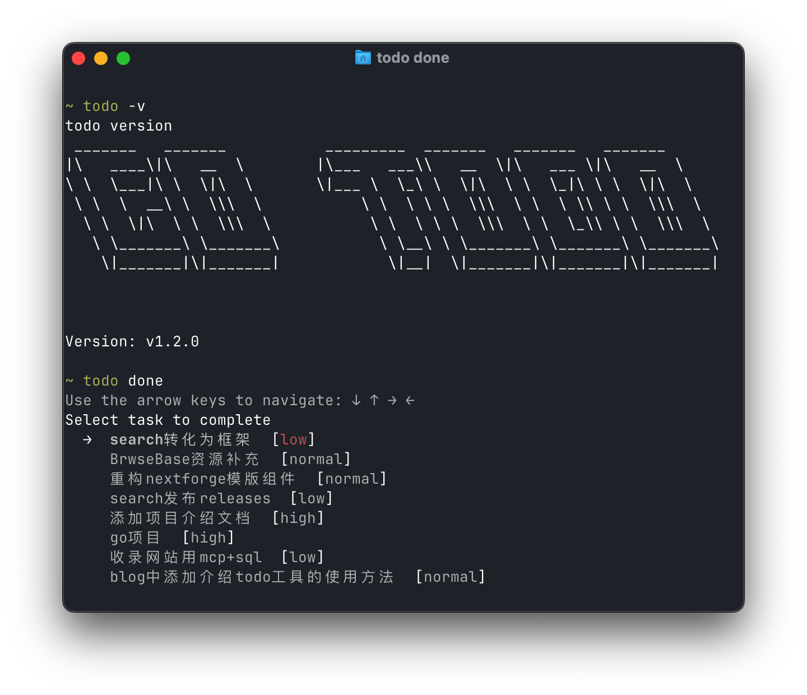
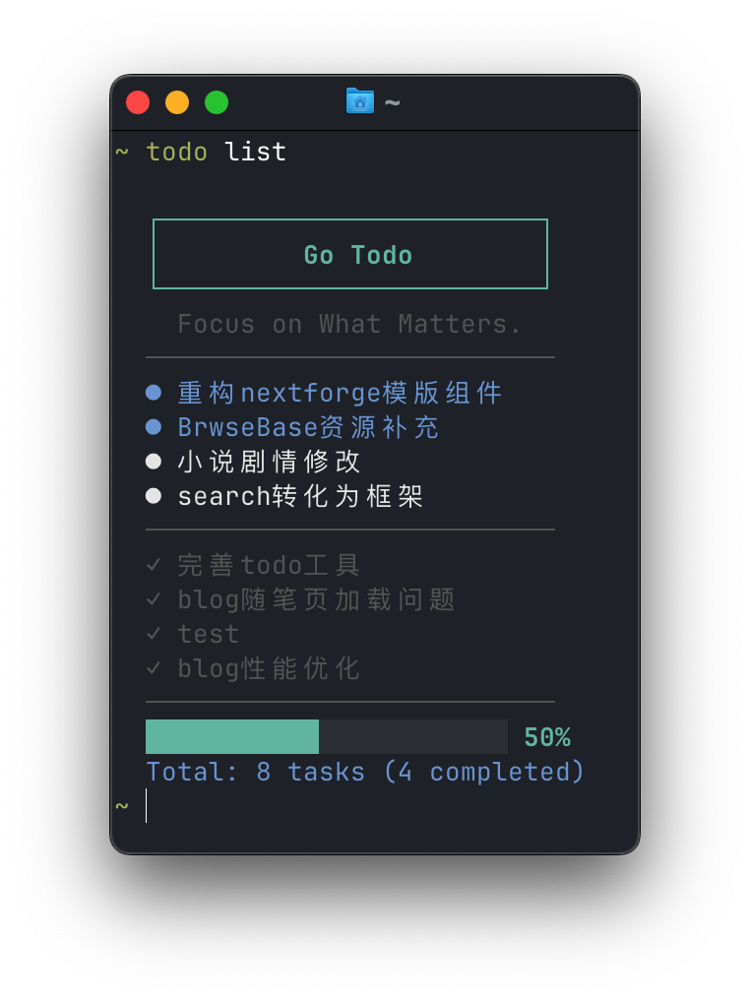

# Todo - A Minimalist Terminal Task Manager

[English](REDME_zh.md) | [中文](README_zh.md)

Todo is a terminal task management tool written in Go, focused on efficiently managing your todos.





## 📦 Installation

### Using Go Install (Recommended)

```bash
go install github.com/Lily-404/todo@latest
```

### Build from Source

1. Clone the repository

```bash
git clone https://github.com/Lily-404/todo.git
cd todo
```

2. Build the project

```bash
go build
```

## 🚀 Usage

### Basic Commands

- `todo task` or `todo t` - Interactive task management
- `todo add` or `todo a` - Add a task
- `todo list` or `todo l` - List tasks
- `todo remove` or `todo rm` - Remove a task
- `todo done` or `todo d` - Complete a task
- `todo clean` or `todo c` - Clean tasks
- `todo lang` - Change language settings

### Examples

1. Add a task

```bash
todo add "Complete project documentation"
```

2. Add a task with priority

```bash
todo add "Prepare meeting presentation" -p high
```

3. Add a task with due date

```bash
todo add "Submit quarterly report" -d "2024-03-31"
```

4. View all tasks

```bash
todo list
```

5. Manage tasks interactively

```bash
todo task
```

## 📁 Data Storage

**The application stores its data in the following locations:**

### macOS/Linux

* Configuration: `~/.config/gotodo/config.json`
* Task Data: `~/.local/share/gotodo/notes/notes.json`

### Windows

* Configuration: `%APPDATA%\gotodo\config.json`
* Task Data: `%APPDATA%\gotodo\notes\notes.json`

## 🎨 Features

- Priority Management: Supports three priority levels - high, normal, and low
- Interactive Operation: Easily manage tasks through an interactive interface
- Progress Statistics: Visually display task completion progress
- Colorful Output: Enhanced readability with colored text
- Internationalization: Supports both Chinese and English interfaces

## 🤝 Contributing

Issues and Pull Requests are welcome!

## 📄 License

MIT License
